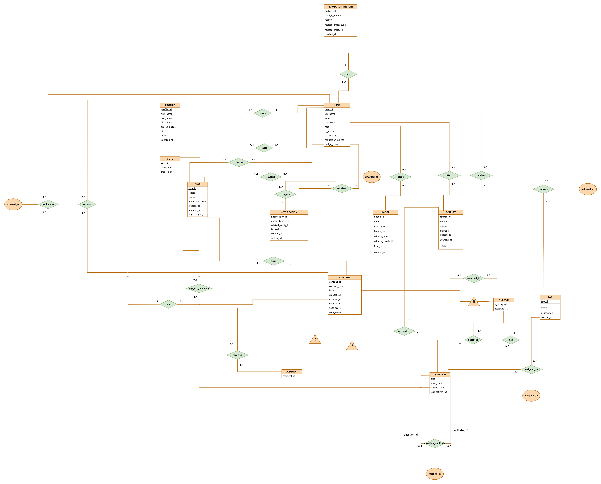

# DevQuest

---

A Stack Overflow-style developer Q&A platform built with Next.js, Express.js, and PostgreSQL as part of my CSE Level 2 Term 1 DBMS project. Users can ask and answer questions, vote on content, earn reputation and badges, follow tags, offer bounties, and receive real-time notifications.
Move down [below](https://github.com/fahim07ms/devquest/#Prerequisites) if you want to set up the project locally right away.
---

## Key Features

- **Questions & Answers** — rich text editor (TipTap) with code blocks, image embeds, and math
- **Voting** — upvote and downvote questions, answers, and comments
- **Reputation system** — points awarded and deducted automatically via PostgreSQL triggers
- **Badges** — earned automatically when thresholds are crossed (question count, answer count, vote score)
- **Bounties** — offer reputation points to attract better answers; auto-awarded on expiry if a qualifying answer exists
- **Notifications** — in-app notifications for new answers, accepted answers, badges, bounties, and mentions
- **Tag follow** — follow tags to see a personalised question feed on the dashboard
- **Flags & moderation** — users can flag content; moderators can review, freeze, and unfreeze content
- **Bookmarks** — save questions for later
- **Profile pages** — public profile with questions, answers, badges, reputation history, and acceptance rate

---

## Tech Stack

| Layer | Technology |
|-------|-----------|
| Backend | Express.js, Node.js (ESM) |
| Database | PostgreSQL 15 |
| ORM / Query | `pg` (node-postgres) — raw SQL, no ORM |
| Auth | JWT (access + refresh token rotation) via HTTP-only cookies |
| File uploads | Cloudinary |
| Validation | Zod (frontend and backend) |
| Frontend | Next.js 15, React, TypeScript, Tailwind CSS, shadcn/ui |
| State management | Zustand with persist middleware |
| Rich text editor | TipTap |

---
## Database Schema Overview

Below is the ER Diagram of the database (made using [draw.io](drawio.com)):



The schema uses a unified `content` table for questions, answers, and comments (single-table inheritance pattern), with specialised child tables (`question`, `answer`, `comment`) extending it via a shared `content_id` primary key.

```
content          ← base table
├── question     ← extends content
├── answer       ← extends content
└── comment      ← extends content

user             ← accounts (reputation_points, badge_count)
├── profile      ← extended profile data (bio, website, profile_picture)
├── badge_award  ← M:N between user and badge
├── reputation_history ← full audit log of all rep changes
└── notification ← in-app notification inbox

tag              ← topic tags
├── question_tag ← M:N between question and tag
└── user_tag_follow ← M:N between user and tag (follow system)

vote             ← upvotes/downvotes on any content
bookmark         ← saved questions per user
bounty           ← reputation bounties on questions
flag             ← content reports for moderation
```

---

## API Overview

All endpoints are prefixed with `/api`. The backend runs on port `4000` by default.

| Resource | Base path |
|----------|-----------|
| Auth | `/api/auth` |
| Users | `/api/users` |
| Questions | `/api/questions` |
| Answers | `/api/answers` |
| Comments | `/api/comments` |
| Votes | `/api/votes` |
| Tags | `/api/tags` |
| Bookmarks | `/api/bookmarks` |
| Flags | `/api/flags` |
| Bounties | `/api/bounties` |
| Notifications | `/api/notifications` |
| Dashboard | `/api/dashboard` |

---

Below is a demonstration showing how you can set it up locally.

## Prerequisites

- Node.js 20+
- npm 10+
- PostgreSQL 15+
- You may also need a free [Cloudinary](https://cloudinary.com) account for profile picture uploads if you want. (Though without it other features will run.)

---

## Clone the Repository

```bash
# Clone Backend
git clone https://github.com/fahim07ms/devquest_backend.git

# Clone Frontend
git clone https://github.com/fahim07ms/devquest_frontend.git
```


## Database Setup
PostgreSQL handles authentication differently depending on your Operating System. Follow the instructions for your platform to create the user and database.

```bash
# For Linux
sudo -u postgres psql

# For macOS 
psql postgres

# For Windows
psql -U postgres
```

Then run:
```sql
CREATE USER devquest_user WITH PASSWORD 'your_password';
CREATE DATABASE devquest OWNER devquest_user;
GRANT ALL PRIVILEGES ON DATABASE devquest TO devquest_user;
\q
```

### Initialize the Schema:

```bash
# Navigate to backend
cd devquest_backend

# Run the initialization 
psql -U devquest_user -d devquest -h localhost -f db/init.sql
```

---

## Backend Configuration

### Install dependencies
```bash
cd devquest_backend
npm install
```

### Configure environment variables
Create a `.env` file in `devquest_backend/`:

```bash
# Linux / macOS
cp .env.example .env

# Windows (Command Prompt)
copy .env.example .env
```

Then fill in the values:

```env
# Database
DB_HOST=localhost 
DB_USER=devquest_user
DB_DATABASE=devquest
DB_PASS=your_password # Password you wrote
DB_PORT=5432

# App 
NODE_ENV=development
FRONTEND_URL=http://localhost:3000
PORT=4000

# Auth 
# JWT — generate your own strong secrets
JWT_SECRET=my_strong_jwt_secret 
REFRESH_SECRET=my_strong_refresh_secret
JWT_EXPIRES_IN=15m
REFRESH_EXPIRES_IN=7d

# Cloudinary (profile picture uploads)
# Sign up at https://cloudinary.com → copy these three values from settings
CLOUDINARY_CLOUD_NAME=your_cloud_name
CLOUDINARY_API_KEY=your_api_key
CLOUDINARY_API_SECRET=your_api_secret
```

Then run:
```bash
npm run dev
```

API runs at [http://localhost:4000](http://localhost:4000).

---

## Frontend

### Install dependencies

```bash
cd devquest_frontend
npm install
```

### Configure environment variables

Create a `.env.local` file in `devquest_frontend/`, then fill in the values:

```env
# URL of the running backend API — must match the backend PORT
NEXT_PUBLIC_API_URL=http://localhost:4000/api

# Set to development locally
NODE_ENV=development
```

### Start the frontend

```bash
npm run dev
```

The app will be available at [http://localhost:3000](http://localhost:3000).

---